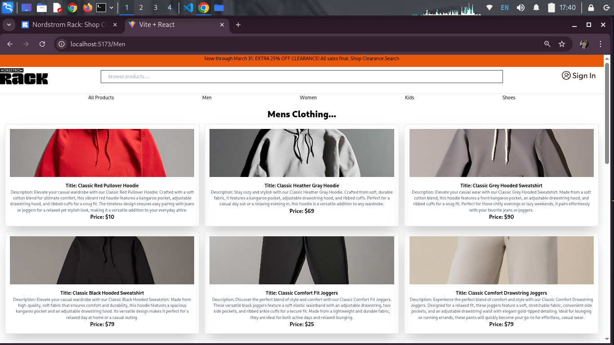
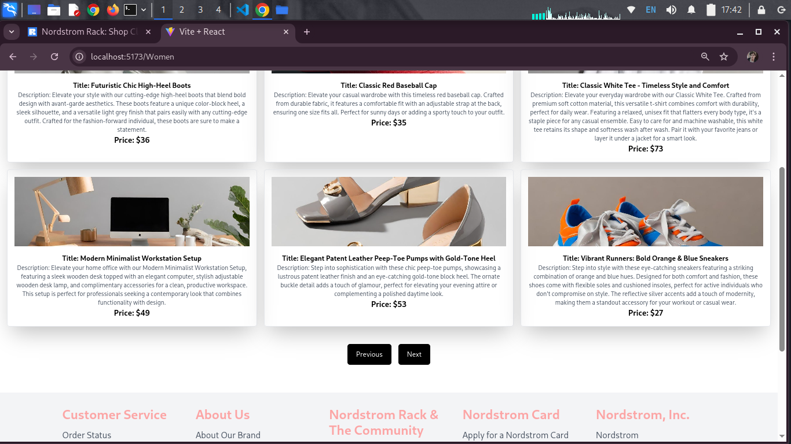
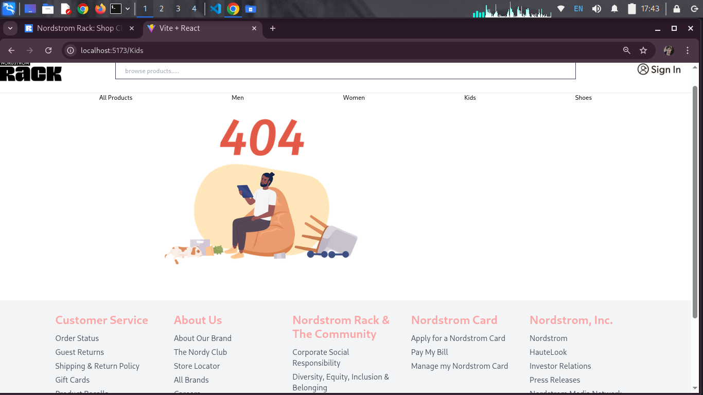

# NordStorm Assignment

This project is a **React-based e-commerce application** built using **Vite**. It showcases various product categories like **Men's Clothing**, **Women's Clothing**, **Kids' Products**, **Shoes**, and more. The application includes features like **pagination**, **loading spinners**, and **error handling** for a seamless user experience.

---

## 🚀 Features

- **Dynamic Product Rendering**: Fetches data from an external API and displays it dynamically.
- **Category-Based Filtering**: Displays products based on categories like Men's Clothing, Women's Clothing, Kids' Products, Shoes, etc.
- **Pagination**: Allows users to navigate through products in chunks.
- **Loading Spinner**: Displays a spinner while data is being fetched.
- **Error Handling**: Shows an error message or image when the API call fails.
- **Responsive Design**: Fully responsive layout using **Tailwind CSS**.

---

## 🛠️ Tech Stack

- **React**: Frontend library for building the UI.
- **Vite**: Fast build tool for modern web projects.
- **Axios**: For making API requests.
- **Tailwind CSS**: For styling the application.
- **React Spinners**: For loading indicators.

---

## 📸 Screenshots

### Home Page


### Men's Clothing


### Women's Products


### error handling



---

## 📂 Folder Structure
NordStorm-Assignment/ ├── src/ │ ├── components/ │ │ ├── Header.jsx │ │ ├── Footer.jsx │ ├── pages/ │ │ ├── HomePage.jsx │ │ ├── Men.jsx │ │ ├── Women.jsx │ │ ├── Kids.jsx │ │ ├── Shoes.jsx │ │ ├── AllProducts.jsx │ ├── App.jsx │ ├── main.jsx ├── public/ │ ├── screenshots/ │ │ ├── homepage.png │ │ ├── mens-clothing.png │ │ ├── womens-products.png │ │ ├── kids-products.png │ │ ├── shoes.png ├── README.md ├── package.json ├── vite.config.js

---

## 📦 Installation

1. Clone the repository:
   ```bash
   git clone https://github.com/your-username/nordstorm-assignment.git
   cd nordstorm-assignment
   npm install